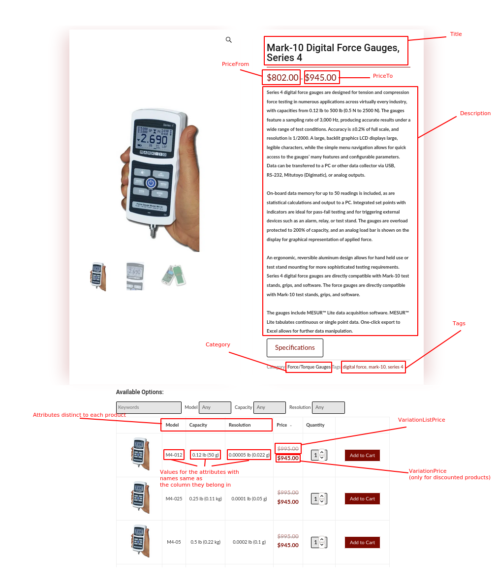

# Assignment 2 - Structured data extraction

For this assignment, we implemented content extractors using regular expressions, XPath and automatic web extraction with a roadrunner-like algorithm. We tested our implementation using the provided offline web pages and a third one of our choice.

## Additional website
We chose [Global Scale Company](globalscalecompany.com)'s website. It has mix of both data and list elements. The structure of the page and the names of the fields that we extracted are shown on the image below. 

## Execution
There are no additional libraries that need to be downloaded.
 
You need to call `run-extractor.py` with the type of the extractor needed: _regex_, _xpath_, _roadrunner_.
Example: `run-extractor.py regex`

Each extractor prints the result on standard output. The name of the domain is also printed for better distinction of the results 
